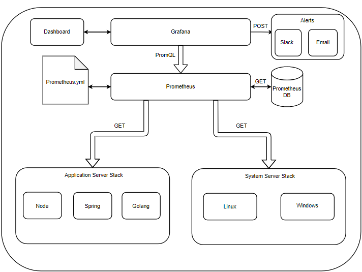

# Architecture Diagram



# Execution 

## Locally:
```
./prometheus --config.file=prometheus.yml
```

## Docker:
```
sudo docker run     -p 9090:9090     -v /home/kc/Desktop/credit_suisse/prometheus/prometheus.yml:/etc/prometheus/prometheus.yml     prom/prometheus
```
# SRS:

<object data="SRS.pdf" width="700px" height="700px">
    <embed src="SRS.pdf">
        <p>This browser does not support embedded PDFs. Please download the PDF to view it: <a href="SRS.pdf">Download PDF</a>.</p>
    </embed>
</object>